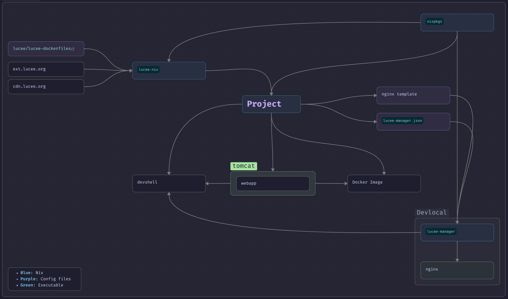

# Lucee-Nix

A Nix flake, providing declarative infrastructure for [Lucee Server](https://www.lucee.org/) (CFML engine) development & deployments.

## Table of Contents

1. [Architecture Overview](#architecture-overview)
2. [API Reference](#api-reference)
   - [Core Functions](#core-functions)
   - [Extension Functions](#extension-functions)
   - [Docker Functions](#docker-functions)
3. [Configuration Reference](#configuration-reference)
   - [CFConfig Schema](#cfconfig-schema)
   - [Environment Variables](#environment-variables)
   - [Docker Configuration](#docker-configuration)
4. [Examples & Use Cases](#examples--use-cases)
   - [Development Setup](#development-setup)
   - [Production Deployment](#production-deployment)
5. [Advanced Topics](#advanced-topics)
   - [lucee-manager integration](#integration-overview)
   - [CI/CD Integration](#cicd-integration)

## Architecture Overview

The Lucee-Nix flake provides a modern, infrastructure-as-code approach to deploying CFML applications using Nix's reproducible build system. It uses **overlay patterns** to extend nixpkgs with Lucee-specific functionality.


### Prerequisites
- [Nix](https://nixos.org/)

### Core Design Patterns

- **Nix Overlays**: Extends nixpkgs without modifying core packages
- **Passthru Attributes**: Metadata flows through derivations for automatic dependency resolution
- **Declarative Configuration**: All infrastructure defined in Nix expressions
- **Environment Inheritance**: Development configurations extend to production with selective overrides
- **Single Mode Deployment**: Optimized for Lucee's single-mode architecture
- **Designed for Lucee 7 zero**: Designed & Tested for use with Lucee 7+ (lucee 5.2 or newer may or may not work, `cfConfig` will only apply for Lucee 6 and newer)

### Key Components

```
lucee-nix/
├── flake.nix           # Main flake configuration and overlay definition
├── lucee.nix           # Core Lucee packaging logic
├── docker.nix          # Docker image building functionality  
├── extensions/         # Extension management system
│   ├── default.nix     # Extension builder functions
│   └── definitions.nix # Pre-defined extension catalog
│
└── examples/           # Complete usage examples
    ├── flake.example.nix
    └── production.env.example
```

---

## API Reference

### Core Functions

#### `mkTomcatLucee`

Creates a Tomcat server instance configured with Lucee Server.

```nix
mkTomcatLucee {
  baseDir ? "ROOT";              # Web application base directory
  port ? 8888;                   # HTTP port for development server  
  luceeJar ? "lucee7-zero";      # Lucee JAR version identifier
  tomcatPackage ? <auto>;        # Tomcat package (auto-selected based on luceeJar)
}
```

**Parameters:**

- **`baseDir`** (string, optional): Directory in `webapps` containing your web application files. Defaults to `"ROOT"`.
- **`port`** (integer, optional): HTTP port for the development server. Defaults to `8888`.
- **`luceeJar`** (string, optional): Lucee JAR version to use. Available options:
  - `"lucee7-zero"` (default) - Lucee 7.0.1.100 without bundled extensions
- **`tomcatPackage`** (package, optional): Tomcat package to use. Auto-selected based on `luceeJar` compatibility:
  - Lucee 7.x → Tomcat 11 (Java 25 compatible)

**Returns:** A derivation containing a configured Tomcat+Lucee server instance.

**Passthru Attributes:**
- `tomcatPackage` - The Tomcat package used
- `javaVersion` - Required Java version for compatibility

**Example:**
```nix
let
  luceeServer = pkgs.mkTomcatLucee {
    port = 8080;
  };
in
{
  # Use in development shell
  devShells.default = pkgs.mkShell {
    buildInputs = [ luceeServer ];
  };
}
```

---

### Extension Functions

#### `mkLuceeExtension`

Downloads a Lucee extension (.lex file) from the [official Lucee extension repository](https://download.lucee.org/#ext).

```nix
mkLuceeExtension {
  name;                         # Extension name (required)
  description ? "";             # Human-readable description
  version;                      # Extension version (required) 
  sha256 ? lib.fakeHash;        # SHA256 hash for reproducible builds
}
```

**Parameters:**

- **`name`** (string, required): Extension identifier used in the download URL
- **`description`** (string, optional): Human-readable description of the extension
- **`version`** (string, required): Specific version to download
- **`sha256`** (string, optional): SHA256 hash of the extension file for verification. Run `nix-prefetch-url [url]` to generate the right hash.

**Returns:** A derivation containing the .lex extension file.

**Download URL Pattern:** `https://ext.lucee.org/{name}-{version}.lex`

**Example:**
```nix
myExtension = pkgs.mkLuceeExtension {
  name = "org.postgresql.jdbc";
  description = "PostgreSQL JDBC Driver";
  version = "42.7.7";
  sha256 = "0yd0n2ngwqf536knslpmhi3pixqnxfm0rk3jxy8abvihq9mdri4l";
};
```

#### `luceeExtensions`

Pre-built catalog of commonly used Lucee extensions.

**Available Extensions:**

To see all available extensions and their versions:

```bash
# List extension names
nix eval --impure --expr 'let flake = builtins.getFlake "github:emotions-ch/lucee-nix"; pkgs = import <nixpkgs> { overlays = [ flake.overlays.default ]; }; in builtins.attrNames pkgs.luceeExtensions'

# List extensions with versions
nix eval --impure --expr 'let flake = builtins.getFlake "github:emotions-ch/lucee-nix"; pkgs = import <nixpkgs> { overlays = [ flake.overlays.default ]; }; in builtins.mapAttrs (name: ext: ext.version) pkgs.luceeExtensions' --json
```

**Usage:**
```nix
extensions = [
  pkgs.luceeExtensions."org.postgresql.jdbc"
  pkgs.luceeExtensions.image-extension  
  pkgs.luceeExtensions.compress
];
```

---

### Docker Functions

#### `mkLuceeDockerImage`

Creates production-ready Docker images for Lucee applications with security best practices and operational features.

```nix
mkLuceeDockerImage {
  lucee;                                    # Tomcat+Lucee instance (required)
  extensions ? [];                          # List of Lucee extensions
  cfConfig;                                 # CFConfig configuration object (required)
  project;                                  # Project name (required)
  webapp;                                   # Path to webapp directory (required)
  isMasa ? false;                           # Required for Masa CMS applications
  LUCEE_JAVA_OPTS ? "-Xms64m -Xmx512m";     # JVM options
  javaPackage ? pkgs.openjdk25;             # Java runtime package
  tag ? "latest";                           # Docker image tag
  name ? project;                           # Docker image name
  imageConfig ? {};                         # Additional Docker image configuration
}
```

**Parameters:**

- **`lucee`** (derivation, required): Tomcat+Lucee instance from `mkTomcatLucee`
- **`extensions`** (list, optional): List of Lucee extension derivations to install
- **`cfConfig`** (attrset, required): CFConfig configuration object (see [CFConfig Schema](#cfconfig-schema))
- **`project`** (string, required): Project identifier used for naming and configuration
- **`webapp`** (path, required): Path to directory containing your CFML application files
- **`isMasa`** (boolean, optional): Enable Masa CMS-specific optimizations (cache directories, permissions)
- **`LUCEE_JAVA_OPTS`** (string, optional): JVM memory and runtime options
- **`javaPackage`** (package, optional): Java runtime package to use
- **`tag`** (string, optional): Docker image tag for versioning
- **`name`** (string, optional): Docker image repository name
- **`imageConfig`** (attrset, optional): Additional Docker image configuration [Docker image configuration](#docker-configuration)

**Returns:** A Docker image derivation ready for container deployment.

**Container Features:**
- **Security**: Runs as non-root `lucee` user (UID 1000)
- **Health Checks**: HTTP endpoint monitoring on `/` for Masa applications and `/health/` for non-Masa applications
- **Signal Handling**: Proper SIGTERM/SIGINT handling for graceful shutdown
- **Configuration**: CFConfig JSON deployment with environment substitution
- **Extensions**: Automatic deployment of .lex files during build
- **Logging**: Structured logging with configurable levels

**Example:**
```nix
dockerImage = pkgs.mkLuceeDockerImage {
  inherit lucee extensions project;
  webapp = ./wwwroot;
  cfConfig = prodCfConfig;
  isMasa = true;
  
  # Container registry configuration
  name = "ghcr.io/myorg/myproject";
  imageConfig = {
    Labels = {
      "org.opencontainers.image.source" = "https://github.com/myorg/myproject";
    };
  };
};
```

---

## Configuration Reference

### CFConfig Schema

CFConfig provides declarative Lucee server configuration through JSON. The lucee-nix flake supports the full CFConfig schema with environment variable substitution.

See [Lucee docs](https://docs.lucee.org/recipes/configuration.html) for config options.

### Environment Variables

#### Development Environment

```bash
# Catalina Configuration
CATALINA_HOME=/nix/store/...-tomcat-lucee
CATALINA_BASE=./lucee-instance
JAVA_HOME=/nix/store/...-openjdk25

# Database Secrets (file-based)
# Create files: {hostname}.secret containing database passwords
# Example: db.example.com.secret
```

#### Production Environment

```bash
# Required Database Configuration
DATABASE_USERNAME=myuser          # Database username
DATABASE_PASSWORD=secretpassword  # Database password  
DATABASE_HOST=db.example.com      # Database hostname
DATABASE_PORT=5432                # Database port

# Optional JVM Configuration
LUCEE_JAVA_OPTS="-Xms256m -Xmx1024m -XX:+UseG1GC"

# Optional Application Configuration  
TZ=UTC                            # Timezone
LOG_LEVEL=INFO              # Logging level
```

#### Environment Variable Substitution

CFConfig supports environment variable substitution using `${VARIABLE_NAME}` syntax:

```nix
cfConfig = {
  dataSources.myapp = {
    username = "\${DATABASE_USERNAME}";
    password = "\${DATABASE_PASSWORD}";
    host = "\${DATABASE_HOST}";
    port = "\${DATABASE_PORT}";
  };
};
```

### Docker Configuration

#### Container Image Configuration
For available options see: [opencontainers/image-spec](https://github.com/opencontainers/image-spec)

```nix
imageConfig = {
  # Container Labels (OCI Standard)
  Labels = {
    "org.opencontainers.image.title" = "My Lucee App";
    "org.opencontainers.image.description" = "CFML application";
    "org.opencontainers.image.source" = "https://github.com/myorg/myapp";
    "org.opencontainers.image.version" = "1.0.0";
    "org.opencontainers.image.created" = "2024-01-01T00:00:00Z";
  };
};
```

---

## Examples & Use Cases

for a full example (Masa Project with devshell & deployment) see [full flake example](./examples/full/flake.nix)

### Development Setup

#### Basic Development Environment

A basic flake for `nix develop` use only. [devshell example](./examples/devshell/flake.nix)

### Production Deployment

#### Production Docker Image

A basic flake providing nothing but `dockerImage` output. [docker example](./examples/docker/flake.nix)

##### Container Deployment

```bash
# Build and load image
nix build .#dockerImage
docker load < result

# Run with environment configuration
docker run -d \
  --name myproject \
  -p 8080:8888 \
  -e DATABASE_USERNAME=produser \
  -e DATABASE_PASSWORD=secret \
  -e DATABASE_HOST=prod-db.example.com \
  -e DATABASE_PORT=5432 \
  ghcr.io/myorg/myproject:v1.0.0
```

---

## Advanced Topics

### Multi-Project Development with lucee-manager (highly recommended)

For development with multiple Lucee projects, [lucee-manager](https://github.com/emotions-ch/lucee-manager/) provides **reverse proxy management** and **dynamic port allocation**.

#### Integration Overview

The lucee-nix flake automatically integrates with lucee-manager through a configuration file:

`lucee-instance/conf/lucee-manager.json`
```nix
# Automatic lucee-manager integration in your flake
luceeManagerJson = pkgs.writeText "lucee-manager.json" (builtins.toJSON {
  project = "myproject";
  domain = "myproject.devlocal.emotions.ch"; # *.devlocal.emotions.ch resolves as 127.0.0.1
  # Optional: Custom nginx template for special routing needs
  nginx.templateFile = ./nginx.conf;  
});
```

Modify your `initScript` to place the file in the right location:
```nix
initScript = pkgs.writeShellScriptBin "init-lucee" ''
    # ...
    cp -f ${luceeManagerJson} $CATALINA_BASE/conf/lucee-manager.json
    # ...
'';
```

### CI/CD Integration

#### GitHub Actions Workflow

A complete CI pipeline example for Lucee applications with health checks and container registry publishing. See the [full example workflow](./examples/full/.github/workflows/ci.yml) for a complete GitHub Actions configuration.

**Key Features:**
- **Nix Flake Validation**: Ensures your flake configuration is valid and properly formatted
- **Docker Build**: Builds your application container using Nix
- **Health Checks**: Validates container startup, database connectivity, and application initialization
- **GHCR Publishing**: Automatically publishes images to GitHub Container Registry on push
- **Multi-Environment**: Supports different branch-based deployments (main, staging, production)

**Required GitHub Secrets:**
```bash
DATABASE_HOST=your-db-host.com
DATABASE_PORT=5432
DATABASE_USERNAME=your-db-user
DATABASE_PASSWORD=your-db-password
```

#### Multi-Stage Deployment

```nix
# Different configurations for different environments
outputs = {
  packages = {
    # Development image with debugging tools
    dev-image = pkgs.mkLuceeDockerImage {
      inherit lucee extensions;
      cfConfig = devCfConfig;
      webapp = ./wwwroot;
      
      # Development JVM settings
      LUCEE_JAVA_OPTS = "-Xms64m -Xmx512m -Xdebug -Xrunjdwp:transport=dt_socket,server=y,suspend=n,address=5005";
      
      imageConfig.Env = [
        "LOG_LEVEL=DEBUG"
        "LUCEE_ENABLE_DEBUG=true"
      ];
    };
    
    # Staging image with monitoring
    staging-image = pkgs.mkLuceeDockerImage {
      inherit lucee extensions;
      cfConfig = stagingCfConfig;
      webapp = ./wwwroot;
      
      LUCEE_JAVA_OPTS = "-Xms256m -Xmx1024m -XX:+UseG1GC";
      name = "ghcr.io/myorg/myproject";
      tag = "staging";
    };
    
    # Production image optimized for performance
    prod-image = pkgs.mkLuceeDockerImage {
      inherit lucee;
      extensions = prodExtensions;  # Minimal extension set
      cfConfig = prodCfConfig;
      webapp = ./wwwroot;
      
      # Production JVM tuning
      LUCEE_JAVA_OPTS = "-Xms512m -Xmx2048m -XX:+UseG1GC -XX:MaxGCPauseMillis=100";
      name = "ghcr.io/myorg/myproject";
      tag = "latest";
      
      imageConfig = {
        Labels = {
          "org.opencontainers.image.title" = "MyProject Production";
          "org.opencontainers.image.source" = "https://github.com/myorg/myproject";
        };
      };
    };
  };
};
```
---

